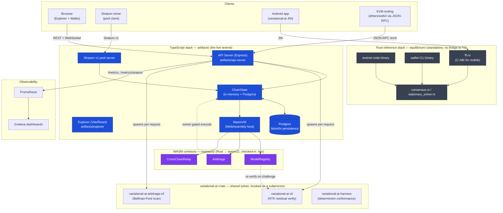

# Architecture

Equilibrium is two parallel, independent implementations of the same protocol, plus a set of satellite services around them. This diagram and the notes below exist to orient a new contributor quickly — see the root `README.md` for full endpoint/feature detail.

## System overview

## Reading the diagram

- **Blue (TypeScript stack)** is what you actually interact with in this Replit environment: the Explorer, the wallet, the REST/WebSocket API, and Postgres-backed persistence. This is the live testnet.
- **Purple (WASM contracts)** are Rust crates compiled to `wasm32-unknown-unknown`, checked in as `.hex` under `contracts/`, and executed inside the TypeScript stack's own `WasmVM` (a deterministic host built on Node's `WebAssembly` global — not a separate node). CI rebuilds each contract from source and fails if the checked-in `.hex` has drifted (see `ci.yml` at the repo root).
- **Gray (Rust reference stack)** — `equilibrium/` — is a standalone consensus engine with its own testnet-node and wallet binaries, and the FFI surface Android uses. It does **not** talk to the TypeScript API server; there is no RPC/IPC bridge between them. It exists as (a) the canonical reference implementation of Proof-of-Stationarity consensus and (b) the mobile SDK.
- **variational-ai** is a separate Rust crate shared by both stacks conceptually (kept in lockstep by the `fpEncode`/address-derivation rules — see README "Architecture Notes"), but only the TypeScript API server invokes it directly, as CLI subprocesses (`variational-ai-cli` for residual verification, `variational-ai-arbitrage-cli` for Bellman-Ford arbitrage scans). The Rust core links the crate's library code in-process instead.
- **Stratum pool** is a separate TCP server inside the API server process, sharing the same `ChainState`.
- **Prometheus/Grafana** scrape `/metrics` and `/metrics/stratum` from the API server; dashboards live in `docs/grafana/`.

## Data flow: submitting a mined block

1. A miner (HTTP `POST /api/blocks/submit` or Stratum share) proposes a solution to the current Lagrangian optimization problem.
2. `ChainState` validates the residual against the adaptive difficulty threshold, checks the `prevHash:nonce` replay set and timestamp drift guard.
3. On acceptance: the block is appended, `wasmVM.setBlockHeight()` syncs the WASM contracts' view of the chain tip, BFT finality voting runs, rewards/fees are distributed, and the block is persisted to Postgres.
4. A `new_block` WebSocket event pushes an instant Explorer refresh.

## Data flow: a contract call

1. Client calls `POST /api/contracts/:address/call` (or a higher-level route like `/api/arbitrage/execute`, which wraps a specific contract).
2. If a `caller` is named, the route verifies an Ed25519 signature over `"contract-call:{address}:{methodId}:{caller}"` before ever touching the WASM VM — this is what prevents impersonation of fund-holding or owner-privileged addresses.
3. `WasmVM.call()` instantiates a **fresh** WebAssembly instance per call (only `contract.storage`, a plain JS object, persists across calls — see `.agents/memory` notes for why contracts must be store-not-compute).
4. The contract's own rules (owner checks, circuit breakers, challenge windows) are the actual authorization boundary; the route-level signature check is just the first, cheap gate.
